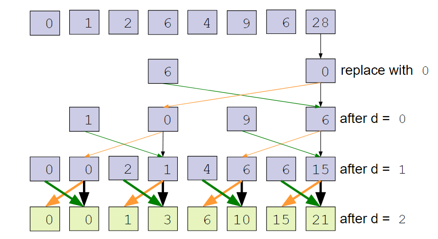
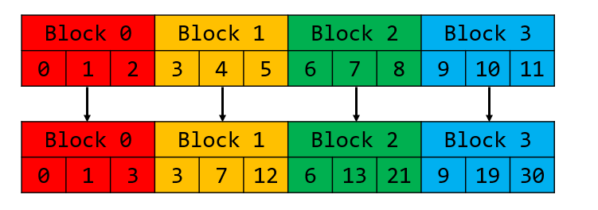
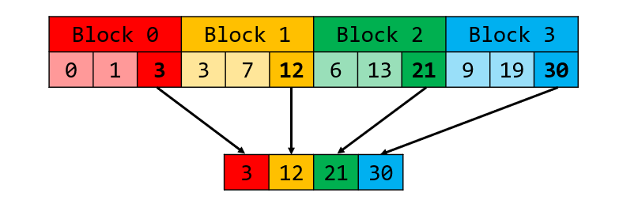
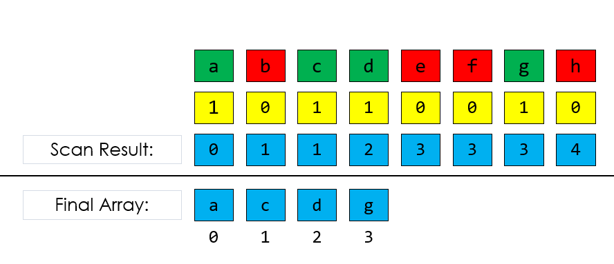
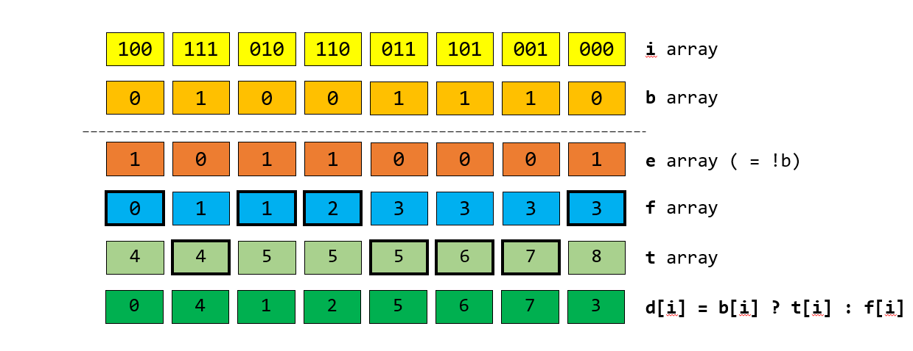

CUDA Stream Compaction
======================

* **University of Pennsylvania, CIS 565: GPU Programming and Architecture, Project 2**
  * Name: Vaibhav Arcot
    
    *  [LinkedIn](https://www.linkedin.com/in/vaibhav-arcot-129829167/)
    
  * Tested on: Windows 10, i7-7700HQ @ 2.8GHz (3.8 Boost) 32GB, External GTX 1080Ti, 11G (My personal laptop)
### Overview
This repo constrains **CUDA** implementations for scans, stream compacts and sorts an array. 
### Scan overview
Scanning is the process of taking a 1d array and returning a new array where each element has the sum of the elements before it. This algorithm is later used in the Character recognition part of the project as well the stream compaction component of this project. All scan versions mentioned in this repo are exclusive scans (zero padded at the front).

#### CPU

 On a CPU, the simplest method for implementing this is to loop over the data and keep track of the sum and replace every cell with it. Besides this, there are ways  to do this in parallel. Three methods were implemented here.

#### Naïve Parallel Scan
This uses the "Naïve" algorithm from GPU Gems 3, Section 39.2.1. Example 39-1 but without the shared component. The idea of this algorithm is to have each thread perform sum up another cell n strides away. By changing n from 2 to max_value, increasing by powers of 2, we are left with the summed array. A pictorial representation is shown below.

#### Work efficient Parallel Scan

Work efficient Parallel scans are an optimization to the Naïve scan. Work is split into 2 phases. The upsweep phase and the down sweep phase. The upsweep phase is a simple parallel reduction (shown below).

For the down sweep phase, we take the array of partial sums and use the tree to compute the scan. This is done by first traverse back down tree using partial sums to build the scan in place. Then the root is set to zero. At each pass, a node passes its value to its left child, and sets the right child to the sum of the previous left child’s value and its value. This is shown below:

#### Share memory Parallel Scan

After implementing the work efficient parallel scan, the next major bottleneck becomes the access speeds of global memory. Because we have a limit on the total amount of memory 1 block can have, we can't just load the entire array into 1 blocks shared memory. The idea is that we split the array over multiple blocks. Each block runs a scan on the part of the array each block should deal with (decided using the blockid). 

Once each scan has finished, we then collect the sum of all the elements and store it in an auxiliary array. We then take that array and run a scan on it (I chose CPU because otherwise the problem becomes recursive). 

Then using this scanned array, each block takes the appropriate value from the auxiliary array and adds that to all its elements in the array. 

Besides the problem of using too much shared memory, there is the first problem of actually synchronizing the threads in a block to prevent them from overwriting each other in the shared memory. To do this, we spawn half the number of items each block needs to scan. Then each thread reads 2 values into shared memory. After that, each thread id can use its value to decide the offset (and wait for each level to finish) and add the result. A similar approach was taken for the down sweep phase.

### Stream compaction overview

Stream compaction is an algorithm used to remove zeros from an array. This is used for collision detection and ray tracing. 

#### Methods
In this repo,  2 methods were implemented. The first (which cannot be run in parallel) is just to run a naive loop over the data and copy it over to a second array if it isn't a zero. 

In order to parallise the copying of data, we head towards  the second method. Here we create a mask array, where 1 indicates an element is non zero.

Then we can run a scan algorithm on the mask array. The resultant values tell the positions for the non zero elements. 

We can then copy over the data (in parallel) because we now know where all the data should go, shown below

#### Different scans

For the second version of this algorithm, different scans can be used. The work efficient scan as well as the shared memory scan was used.

### Radix sort overview 

For the final algorithm implemented in this repo, we perform parallel sorting using radix sort. Parallel radix sort can be thought of in 5 phases:

* Phase 1: We take the input array and extract the bit we are sorting around (in a buffer `b`)
* Phase 2: We take the not of each bit and put the data into another buffer `e`
* Phase 3: We run a scan on `e` to get `f`, which gives us the position of all the bits that are zero. We then take the sum of the final elements in `e` and `f` and call this `totalFalses`
* Phase 4: We use a formula (`t[i] = i – f[i] + totalFalses`) to compute the positions of the true matrix, we call this buffer `t`. 
* Phase 5: We now know the positions of the true and false elements, so we can sort the array (around the current bit) using `t` and `f`, using `d[i] = b[i] ? t[i] : f[i]`, where `d[i]` is the destination array. 

These 5 phases are repeated for all the bits in the numbers to result in a sorted array.

### Results

For results, a LOT (32K) datapoints were collected for the various combinations. Due to time limitations, not all the data could be plotted (pretty), but all the data has been included in the repo. The results shown below were obtained using a linear interpolation on the data (ideally I would plot a curve with variance bands).

### Observations & Optimizations

#### Launching variable number of threads in the work efficient method

I decided to launch the correct number of threads per level in the work efficient implementation. This meant the level loop came into the CPU code and for each iteration the CPU would compute the correct number of threads to spawn. For the shared memory, the loop had to be on the GPU because of the shared memory aspect. Though I don't have concrete results, it seemed like having the loop on the CPU side and spawning the ideal number of threads was more efficient.

#### Data collection scripts
To allow for the large amount of data to be collected, a data collection sctipt was written. It automated the array generation and timed the various coponents of the code and write the resuts (per iteration to make it more robust) to a csv. This helped immensly in collecting the large amount of data I was able to generate. 

#### 1 less loop for the work efficient scan

Because we are already setting the value of the root to zero, while implementing the upsweep phase, I decided to loop 1 less time.

#### Overflow on int value for large sizes

While pushing my code to the limits, I came across an issue where I would overshoot the max value of an int in my scan algorithm. This was an easy fix, but because of this, I have data for the speed when the code overflows (in the repo). The effect fixing this bug had was it didn't increase the time to perform a scan but limited my code to only being able to process array sizes of 2^28. This limit was due to the system running out of memory (explained again)

#### Hitting the max value on malloc

The scan and stream compaction code were able to go to 2^28 (2^31 with the overflow bug). This seems to be a limit a hw limit of using large arrays to store the data. 

#### Beating CPU performance
To beat the CPU (part of the extra credit), I was able to do it only if we don't consider the copying time to the GPU. If we do this, it is only fair to not include the malloc time for the CPU's buffers. If we do this then the GPU code outperforms the CPU code (plot shown below):

#### Thrust speed
From my experiments, thrust seems to perform comparable to my implementations of the algorithms (such as sorting or scanning). The difference is small but my code outperformed thrust for high values (could be statistically insignificant).
